-----

# 🛒 MaxiHome Ferretería – Sistema de Carrito de Compras

## 📋 Descripción del Proyecto

Sistema web de carrito de compras desarrollado para **MaxiHome Ferretería**, una empresa peruana con más de una década de experiencia en la venta de herramientas, materiales de construcción y productos para el hogar. El proyecto implementa un carrito de compras con roles de usuario y administrador, aplicando buenas prácticas de control de versiones con Git.

-----

## 🏢 Contexto de la Empresa

| Aspecto | Descripción |
| :--- | :--- |
| **Nombre del Negocio** | MaxiHome Ferretería |
| **Fundación** | 11 de junio de 2010 (Arequipa, Perú) |
| **Rubro** | Venta de herramientas, materiales de construcción y productos para el hogar |
| **Cobertura** | 8 departamentos del Perú |
| **Problemática** | Falta de una plataforma digital limita su competitividad en el mercado actual |

-----

## 🎯 Objetivos

### Objetivo General

Desarrollar una aplicación funcional de tipo carrito de compras con roles de usuario y administrador, aplicando buenas prácticas de control de versiones con Git.

### Objetivos Específicos

  * Implementar catálogo de productos con nombre, descripción y precio.
  * Desarrollar carrito de compras con funciones de agregar, eliminar y mostrar total.
  * Crear panel de administrador para gestión de productos (CRUD).
  * Aplicar flujo de trabajo con Git usando ramas y commits atómicos.

-----

## ✅ Requisitos Funcionales

### Rol: Usuario 👤

| Funcionalidad | Descripción |
| :--- | :--- |
| Ver productos | Visualizar catálogo de productos disponibles |
| Gestión de carrito | Agregar y quitar productos del carrito |
| Total de compra | Visualizar el total actualizado de la compra |
| Simular compra | Realizar proceso de compra simulada |

### Rol: Administrador 🔒

| Funcionalidad | Descripción |
| :--- | :--- |
| Crear productos | Añadir nuevos productos al catálogo |
| Editar productos | Modificar productos existentes |
| Eliminar productos | Remover productos del catálogo |

-----

## ⚙️ Requisitos No Funcionales

| Tipo | Requisito |
| :--- | :--- |
| **Persistencia** | Base de datos MySQL |
| **Interfaz** | Aplicación web responsive con Bootstrap |
| **Control de versiones** | Git con GitHub |
| **Calidad de código** | Commits descriptivos y atómicos |
| **Arquitectura** | Patrón MVC con Spring Boot |
| **Seguridad** | Acceso restringido para panel administrativo |

-----

## 💻 Tecnologías Utilizadas

| Área | Tecnologías |
| :--- | :--- |
| **Backend** | Spring Boot, Java, Spring Data JPA |
| **Frontend** | Thymeleaf, Bootstrap 5, JavaScript |
| **Base de Datos** | MySQL 8.0 |
| **Control de Versiones** | Git, GitHub |
| **IDE** | Apache NetBeans |
| **Gestión de Dependencias** | Maven |

-----

## 🚀 Instalación y Ejecución

### Prerrequisitos

  * Java 17 o superior
  * MySQL 8.0 o superior
  * Maven 3.6+
  * Git

### Pasos de Instalación

1.  **Clonar el repositorio:**
    ```bash
    git clone https://github.com/TuUsuario/MaxiHome-Web.git
    cd MaxiHome-Web
    ```
2.  **Configurar base de datos:**
      * Crear base de datos MySQL: `maxihome_db`
      * Configurar credenciales en: `src/main/resources/application.properties`
3.  **Ejecutar la aplicación:**
    ```bash
    ./mvnw spring-boot:run
    ```
4.  **Acceder a la aplicación:**
      * URL: `http://localhost:8080`

-----

## 🧑‍💻 Roles y Créditos

| Nombre | Rol | Funciones |
| :--- | :--- | :--- |
| Coveñas Ramirez Renzo Jeanpiere | Desarrollador Full Stack | Análisis, diseño, desarrollo backend/frontend, control de versiones |

-----

## 🌳 Flujo de Trabajo en Git

### Estructura de Ramas

| Rama | Propósito |
| :--- | :--- |
| `main` | Rama principal de producción |
| `feature/` | Desarrollo de nuevas funcionalidades |
| `fix/` | Corrección de errores |
| `docs/` | Documentación del proyecto |

### Comandos Utilizados

```bash
# Crear nueva rama para funcionalidad
git checkout -b feature/agregar-entidad-producto

# Hacer commit de cambios
git add .
git commit -m "feat: add Product entity with JPA annotations"

# Subir cambios al repositorio remoto
git push -u origin feature/agregar-entidad-producto

# Fusionar cambios a main
git checkout main
git merge --no-ff feature/agregar-entidad-producto
```

-----

## 📸 Capturas de Pantalla

### Configuración de Spring
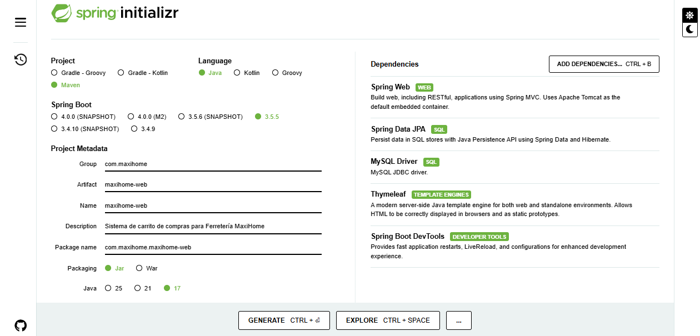

### Estructura Inicial del Proyecto
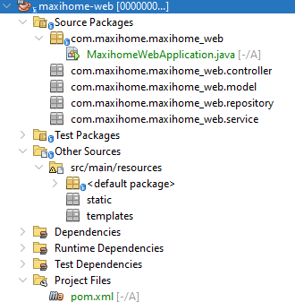

### Configuración inicial del Git y primer commit
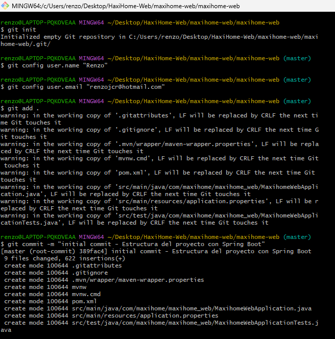

### Conexión y subida del proyecto a Github
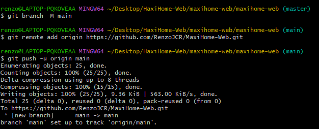

### Repositorio creado en GitHub
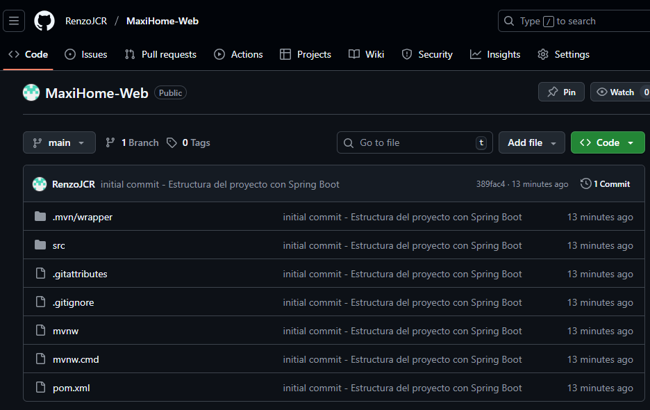

### Commit: Actualización del archivo .gitignore y añadimiento del archivo LICENSE
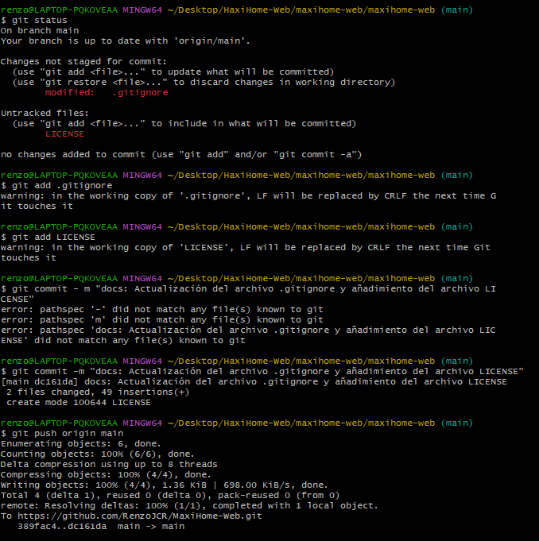

### Commit: Configuración del Application Properties
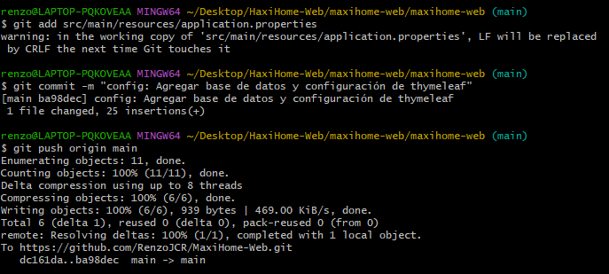

### Creación de una rama para agregar una funcionalidad
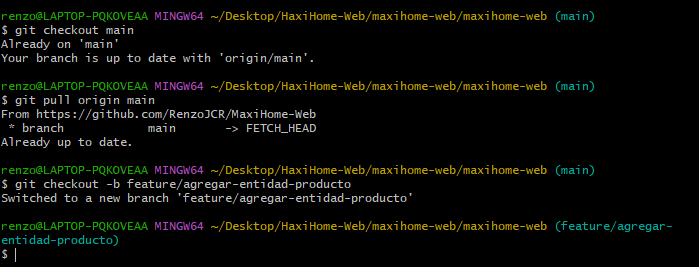

### Salida del git status, commit y push exitoso de la rama
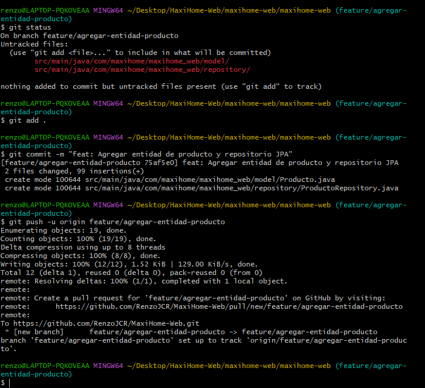

### Merge(fusion) de la rama con el main
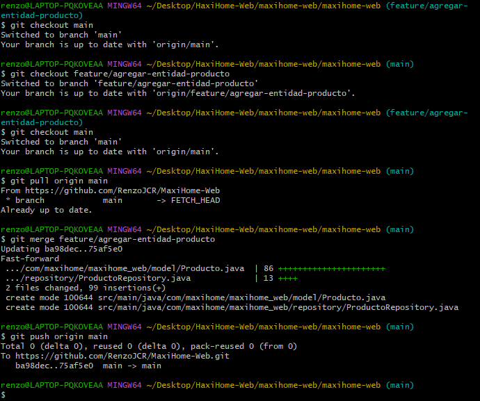

### Eliminación de la rama ya usada del local y del repositorio
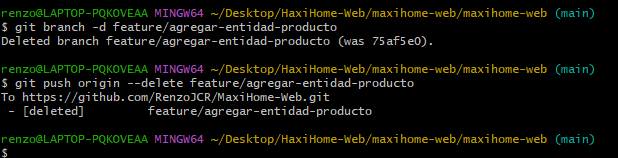

### Creación de una rama para el README, commit y push exitoso
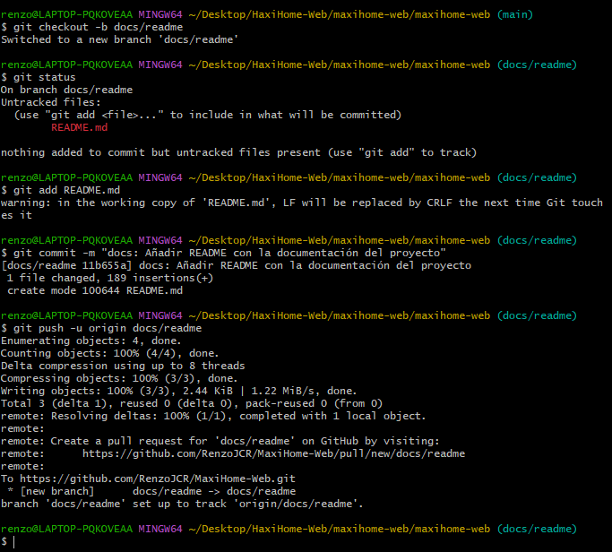

### Merge de la rama "docs/readme"
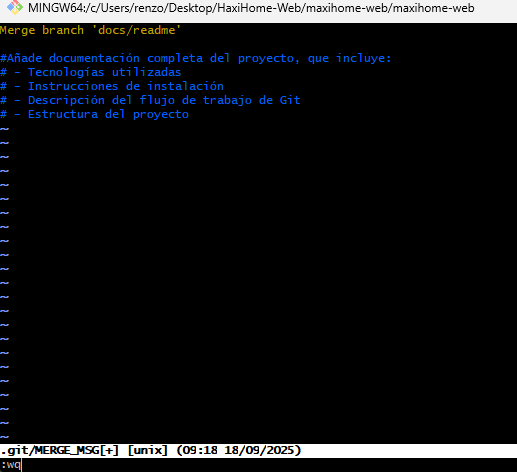

### Merge exitoso con el push
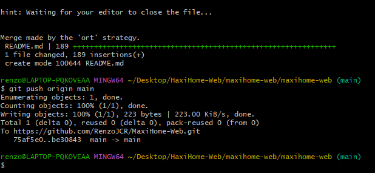

### Actualización del archivo README terminado


---